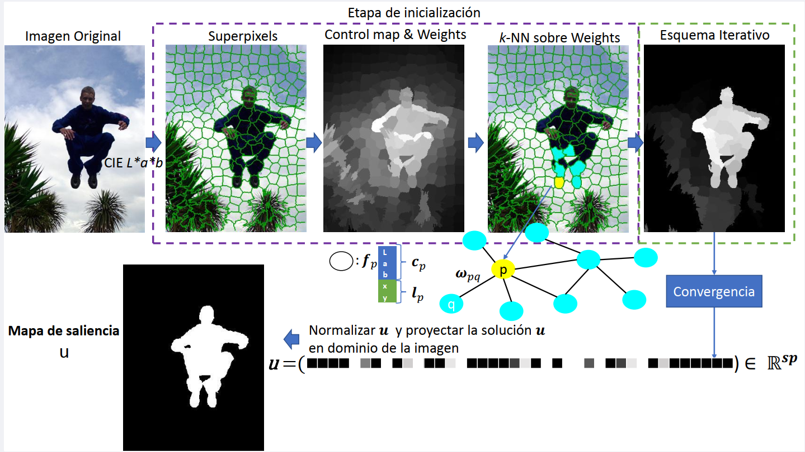
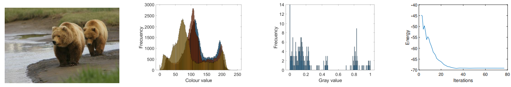

# VariationalSaliencyDetection
Non local convex automatic saliency on manifolds primal-dual algorithm. The workflow our algorithm is:

1) Convert RGB into CIE L*a*b
2) Oversegmentation - Superpixels (SLIC, gSLICr, any other superpixel algithm which produces compact clusters is valid
3) Control map (contrast prior for saliency and object prior), weights for the graph according to colour and position
4) k-NN selection over weights
5) Iterative schema primal-dual until convergence

This code implements the following paper "A non-smooth non-local variational approach to saliency detection in real time" https://link.springer.com/article/10.1007/s11554-020-01016-4 Variational Methods in manifolds for Saliency segmentation

The methods included in this software are the following models:

E(u) = J_{NLTV,w}(u) + \lambda F(u) (Saliency NLTV )   
E(u) = J_{NLTV,w}(u) + \lambda F(u) - H(u) (Saliency NLTV with SaliencyTerm)   

* J_{NLTV,w} ({\mathbf u})=\sum_{p \in V} \left( \sum_{q \in V,, pq\in E} w_{pq}|u_q-u_p|^2 \right)^{1/2}
* F(\mathbf{u})=\frac{1}{\alpha} ||\mathbf{u}-\mathbf{v}^c ||^2 = \frac{1}{2\alpha} \sum_{p\in V} |u_p-v^c_p|^2
* H(\mathbf{u})=\frac{1}{2\alpha^2}\sum_{p\in V} (1-\delta u_p)^2,
* \lamdbda The \lambda parameter is a positive constant for controlling the relative importance of the regularizer vs the fidelity in the functional

The saliency term tries to separate the superpixels into two gropus saliency and no saliency. You can see this effect in the "gray value" histogram where there are two clear groups and compare this with "colour value" histogram where is not a clear separation in groups. 

[1] E. Alcaín, A. Muñoz, I. Ramírez, and E. Schiavi. Modelling Sparse Saliency Maps on Manifolds: Numerical Results and Applications, pages 157{175. Springer International Publishing, Cham, 2019.   
[2] Alcaín, E., Muñoz, A.I., Schiavi, E. et al. A non-smooth non-local variational approach to saliency detection in real time. J Real-Time Image Proc (2020). https://doi.org/10.1007/s11554-020-01016-4
The

This software make use of external code to reproduce superpixels

http://www.robots.ox.ac.uk/~victor/gslicr/ Folder gSLICr
https://ivrlwww.epfl.ch/supplementary_material/RK_SLICSuperpixels/index.html SLIC.cpp

Please find the LICENSE terms in the code in the above links. The superpixel part is decoupled from the saliency algorithm. if you want to implement your own superpixel algorithm please follow ISuperpixel.h interface and code it consequently.

Apart from the superpixel algorithms. The software has dependencies with the following libraries:

cuda SDK 8.0/9.0 SM 3.0 or superior using cusparse and cublas.
Common function from CUDA Samples C:\ProgramData\NVIDIA Corporation\CUDA Samples\v8.0\common\inc\
OpenCV 3.1

The project was compiled with Visual Studio 2015.

You can download the data set

MSRA10K https://mmcheng.net/salobj/
ECSSD http://www.cse.cuhk.edu.hk/leojia/projects/hsaliency/dataset.html
icogseg http://chenlab.ece.cornell.edu/projects/touch-coseg/

Some possible executions to cover the 6 combinations.

* NLTVSalTerm Sal No optimzed version

NLTVSaliencyCuda.exe -lambda=1 -tau_p=0.3 -tau_d=0.33 -delta=0.2 -alpha=1.5 -algCudaVariant=0 -salMethod=1 -spMethod=1

* NLTVSalTerm Sal optimzed version

NLTVSaliencyCuda.exe -lambda=1 -tau_p=0.3 -tau_d=0.33 -delta=0.2 -alpha=1.5 -algCudaVariant=1 -salMethod=1 -spMethod=1

* NLTVSalTerm Sal optimzed version no energy

NLTVSaliencyCuda.exe -lambda=1 -tau_p=0.3 -tau_d=0.33 -delta=0.2 -alpha=1.5 -algCudaVariant=2 -salMethod=1 -spMethod=1 -tol=0

* NLTV Sal No optimzed version

NLTVSaliencyCuda.exe -lambda=0.1 -tau_p=0.3 -tau_d=0.03 -algCudaVariant=0 -salMethod=0 -spMethod=1

* NLTV Sal optimzed version

NLTVSaliencyCuda.exe -lambda=0.1 -tau_p=0.3 -tau_d=0.03 -algCudaVariant=1 -salMethod=0 -spMethod=1

* NLTV Sal optimzed version no energy

NLTVSaliencyCuda.exe -lambda=0.1 -tau_p=0.3 -tau_d=0.03 -algCudaVariant=2 -salMethod=0 -spMethod=1 -tol=0
